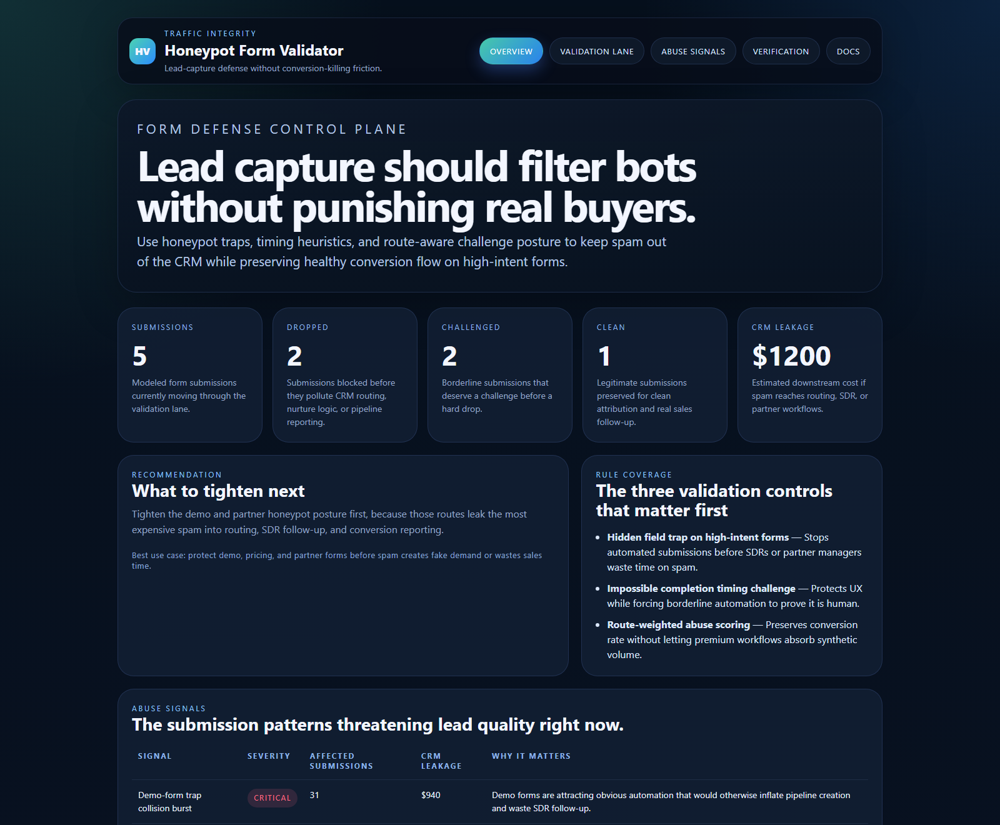
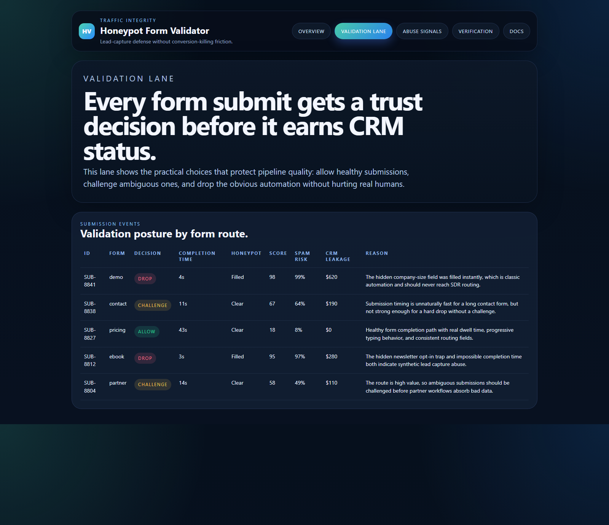
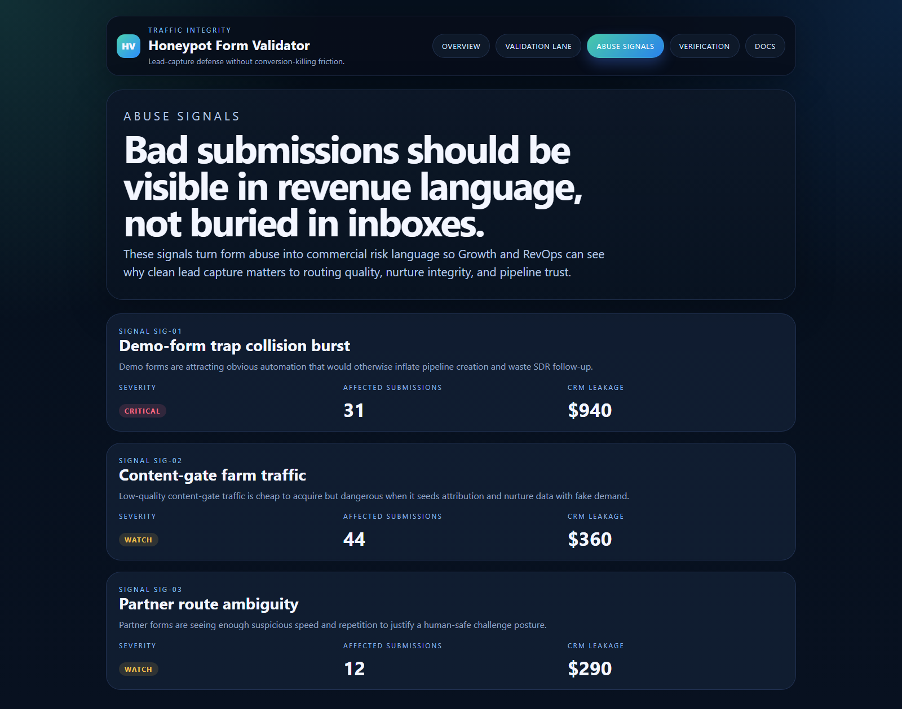
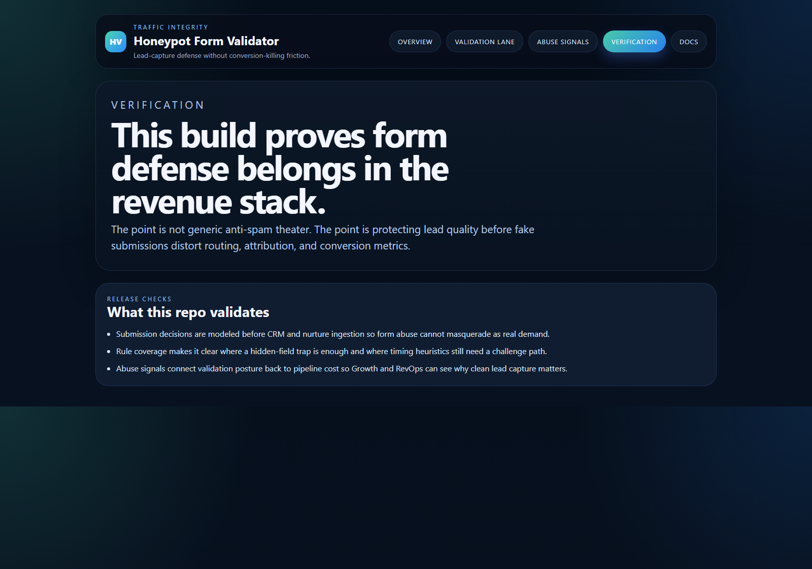

# Honeypot Form Validator

TypeScript control plane for honeypot traps, submission heuristics, and UX-safe spam protection across high-intent lead-capture forms.

## Why this exists

Form abuse is usually treated like a minor spam problem after bad data is already in the CRM. By then:
- demo queues are inflated with fake demand
- SDR follow-up time gets burned on automation
- attribution and nurture data absorb synthetic submissions
- partner and pricing workflows start reacting to junk instead of real buyer intent

`honeypot-form-validator` models the submission-integrity layer early enough to protect routing, attribution, and pipeline reporting before fake leads become false performance.

## Routes

- `/`
- `/validation-lane`
- `/abuse-signals`
- `/verification`
- `/docs`

## API

- `/api/dashboard/summary`
- `/api/validation-lane`
- `/api/rules`
- `/api/abuse-signals`
- `/api/verification`
- `/api/sample`

## Screenshots






## Local Development

```powershell
cd honeypot-form-validator
npm install
npm run dev
```

Open:
- [http://127.0.0.1:5346/](http://127.0.0.1:5346/)
- [http://127.0.0.1:5346/validation-lane](http://127.0.0.1:5346/validation-lane)
- [http://127.0.0.1:5346/abuse-signals](http://127.0.0.1:5346/abuse-signals)
- [http://127.0.0.1:5346/verification](http://127.0.0.1:5346/verification)
- [http://127.0.0.1:5346/docs](http://127.0.0.1:5346/docs)

## Validation

- `npm run build`
- `npm run test`
- `npm run demo`
- `npm run smoke`
- `npm run render:assets`

## Docs

- [Architecture](./docs/architecture.md)
- [Origin](./docs/ORIGIN.md)
- [Changelog](./CHANGELOG.md)
